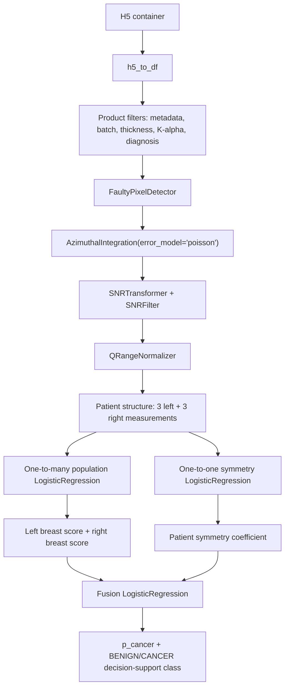

# Aramis Machine Learning Concept

Status: research draft.

This document records the current Aramis modeling concept. It is not a
validated clinical model specification. Aramis remains decision support and
requires radiologist / qualified clinician review.

## Patient Measurement Unit

Each patient is expected to have bilateral breast XRD measurements:

```text
patient
-> left breast:  3 measurements
-> right breast: 3 measurements
```

The model must preserve this structure. Measurements from the same patient,
breast side, and specimen must not be treated as independent patients.

Labels are clinically available at patient level, but the affected breast side
is known. Therefore the practical label unit for Aramis modeling is the
specimen / breast side. All valid measurements from the same breast side inherit
the same label.

Canonical identifiers to preserve:

```text
patientId
specimenId
breast side: Left / Right
measurement position: P1 / P2 / P3
measurementId
```

Draft label propagation:

```text
patient label + known affected side
-> breast-side / specimen label
-> same label for P1, P2, P3 measurements of that breast
```

## Modeling Goal

Draft output:

```text
p_cancer
suggested class: BENIGN or CANCER
```

The output is a decision-support risk score/class, not autonomous diagnosis.

The central modeling goal is to separate benign from malignant breast findings.
Aramis therefore prepares two complementary dataset views that support two
model families and then refine the final prediction together. The one-to-many
model learns BENIGN vs CANCER at the specimen / breast-side level by comparing a
single breast against a population reference. The one-to-one model learns from
the patient-level bilateral context by comparing both breasts within the same
patient, where the contralateral breast can provide control context for
asymmetry.

This requires a two-stage filtering strategy. First, filtering is broad at the
H5 container level: keep patients for whom at least one breast / specimen is
BENIGN or CANCER, but preserve all available breast-side context for those
patients. After `h5_to_df`, split the DataFrame into two datasets. The
one-to-many branch applies a narrow specimen-level filter and keeps only
BENIGN/CANCER breast rows. The one-to-one branch keeps the broader patient
context and then requires paired breast availability; NORMAL contralateral
rows may remain because they can be needed for within-patient comparison. NA
rows are non-informative and should be excluded before model dataset
construction.

Current label-mapping discussion:

```text
specimenId level: BENIGN -> BENIGN group
specimenId level: CANCER -> CANCER group
specimenId level: ATYPICAL -> CANCER group
specimenId level: PRE_CANCEROUS -> CANCER group
specimenId level: NORMAL -> separate NORMAL / control-context group
specimenId level: NA -> non-informative; exclude before model dataset construction
```

The original `specimen_status` must be preserved. Any product label used for
modeling should be written to a separate DataFrame column so that audit and
label-mapping changes remain traceable.

The first model family will use ordinary logistic regression because:

```text
sample size is small
logistic regression is interpretable
previous experiments showed useful performance
coefficients can be inspected and controlled
```

## Three Logistic Regression Components

The current concept uses three logistic regressions:

```text
1. one-to-many population model
2. one-to-one within-patient symmetry model
3. fusion model combining outputs/features from 1 and 2
```

### 1. One-To-Many Population Model

Purpose:

```text
compare one breast / one patient-side against measurements from other patients
detect whether the breast looks closer to malignant or benign population patterns
```

Input candidates:

```text
three measurements from one breast side
population reference measurements from other patients
distance / similarity features against external population
```

Possible feature families:

```text
cosine distance between normalized profiles
profile-distance statistics
distance to benign population
distance to cancer population
nearest-neighbor style summaries
component / complete azimuthal integration features
```

The one-to-many reference set is binary:

```text
benign reference population
cancer reference population
```

The first implementation should not introduce extra reference classes.

Important risk:

```text
this model is highly sensitive to data quality and batch contamination
```

If K-beta, poor AgBH calibration, missing thickness, faulty pixels, or wrong
metadata enter the reference population, population-comparison features can be
misleading. Therefore this model must run only after strict product filtering.

Aggregation is not fixed yet. Candidate aggregation levels:

```text
measurement-level distances -> breast-level feature summary
three breast measurements -> one breast score
patient-side score -> p_cancer_side
```

Most likely first aggregation:

```text
weighted average across the three breast measurements
larger weight for higher-intensity / higher-quality profiles
exact weighting rule: to be defined
```

### 2. One-To-One Within-Patient Symmetry Model

Purpose:

```text
compare the patient with themself
measure left-vs-right breast asymmetry
detect suspicious deviation from expected organ symmetry
```

Input candidates:

```text
left breast measurements: P1, P2, P3
right breast measurements: P1, P2, P3
pairwise left-right distances
within-side replicate consistency
between-side asymmetry statistics
```

Possible feature families:

```text
cosine distance
profile distance
pairwise distance matrix: left P1/P2/P3 vs right P1/P2/P3
summary statistics: min, median, max, mean, variance
within-left distance summary
within-right distance summary
between-left-right distance summary
```

Core idea:

```text
if one breast is healthy and the other is malignant or suspicious,
left-right distance may become abnormally large
```

The one-to-one branch is not simply a binary specimen classifier. It works at
patient paired-breast level, so the label semantics of left-right pairs are
defined at patient level after specimen-side labels are grouped. Current ML
training pair types after excluding NA are:

```text
BENIGN vs CANCER
BENIGN vs NORMAL
CANCER vs NORMAL
```

`NORMAL` is the current healthy/control-context group (`H`). Same-label pairs
are excluded from the first one-to-one ML DataFrame:

```text
BENIGN vs BENIGN
NORMAL vs NORMAL
CANCER vs CANCER
```

Reason: the one-to-one symmetry model learns from left-right differences. With
same-label pairs, the model may not see a useful disease-related difference and
the pair can dilute the asymmetry signal.

Current discussion rule:

```text
exclude NA specimen rows before paired-patient dataset construction
map ATYPICAL/PRE_CANCEROUS into the broad CANCER-side group at specimenId level
preserve NORMAL as a separate specimenId-level status group until training policy is fixed
do not silently treat NORMAL as BENIGN
train one-to-one first on BENIGN-CANCER, BENIGN-NORMAL, CANCER-NORMAL patientId-level pairs
exclude BENIGN-BENIGN, NORMAL-NORMAL, CANCER-CANCER patientId-level pairs from the first ML dataset
```

This model is also sensitive to measurement quality, but less dependent on a
large external population than the one-to-many model.

Clinical interpretation:

```text
large left-right asymmetry is a suspicion signal
asymmetry does not diagnose cancer by itself
asymmetry increases concern and should push the patient toward closer review
```

The one-to-one model is therefore expected to produce a patient-level symmetry
coefficient / asymmetry risk. This coefficient modifies how much trust and
concern the final model assigns to the left and right breast-side population
scores.

### 3. Fusion Logistic Regression

Purpose:

```text
combine the one-to-many and one-to-one model evidence
produce final p_cancer / BENIGN-CANCER suggested class
```

Input candidates:

```text
left breast one-to-many probability / logit
right breast one-to-many probability / logit
one-to-one symmetry coefficient / asymmetry risk
data-quality flags
replicate consistency metrics
batch / calibration validity flags
```

The first fusion concept is a three-signal model:

```text
left breast score
right breast score
patient symmetry coefficient
-> final patient-level p_cancer
```

The one-to-many model gives side-specific evidence: the left breast can look
more cancer-like while the right breast looks more benign-like, or the reverse.
The one-to-one model adds whether the two breast profiles are unexpectedly
asymmetric. When side-specific suspicion and strong asymmetry point in the same
direction, the final patient-level risk should increase.

Output:

```text
final p_cancer
final suggested class
model confidence / conservative referral reason when needed
```

The fusion model is where coefficients/weights between the two model families
will be learned. The current plan is to use cross-validation to estimate and
select the fusion coefficients.

## Draft Pipeline



## Training And Validation Rules

Required split discipline:

```text
split by patientId
no measurement-level leakage
no specimen-level leakage
no population-reference leakage from validation/test patients into training features
```

Required artifacts:

```text
selected_measurement_ids.csv
dropped_measurements.csv
feature_schema.json
label_mapping.json
train_test_split.csv
preprocessing_config.json
model coefficients
model.joblib
metrics.json
predictions.csv
```

Primary metrics:

```text
sensitivity
specificity
ROC AUC
balanced accuracy
PPV
NPV
confusion matrix
threshold
```

For Aramis, false negatives are safety-critical.

Threshold selection should prioritize sensitivity first. Specificity remains a
secondary objective, but it must not be optimized by accepting unsafe false
negative behavior.

If model evidence is uncertain or data quality is not sufficient for a confident
BENIGN decision, the conservative output should be CANCER / requires further
clinical examination rather than an unsafe benign call.

## Data Quality And Monochromaticity

The first Aramis model is constrained by current XRD data quality. A key
limitation is source monochromaticity / K-beta contamination.

Monochromaticity will be controlled from calibration scans. The current approach
uses AgBH calibration profiles and a calibration-based shoulder metric:

```text
AgBH calibration scan
-> azimuthal integration
-> normalized AgBH profile
-> inspect expected AgBH peak positions
-> quantify extra shoulder signal near K-beta-shifted positions
```

Working assumption:

```text
cleaner K-alpha data should not show pronounced extra shoulders in AgBH profiles
```

The product dataset will be built from the best available acquisition days /
batches, where the AgBH shoulder signal is minimal under the documented metric.
This filtering must be recorded in the dataset build artifacts.

The model should therefore be presented as the best model available under the
documented data-quality state, not as the theoretical limit of the method.
Future acquisition improvements are expected to improve model performance:

```text
better K-alpha-only acquisition
more stable AgBH calibration
complete thickness metadata
complete diagnosis / specimen metadata
stable preprocessing version
```

## Current Decisions

Label unit:

```text
specimen / breast side
```

Reason:

```text
patient labels are available
affected breast side is known
all measurements from one breast side share the same label
```

One-to-many reference populations:

```text
benign only
cancer only
```

Fusion coefficients:

```text
learned from data
selected with cross-validation / repeated k-fold when possible
```

Threshold policy:

```text
optimize sensitivity first
avoid false negatives
uncertain cases should be routed toward CANCER / further examination
```

## Open Questions

1. How should the three measurements per breast be aggregated?

```text
simple average
weighted average by profile intensity / quality
mean / median of logits
distance-summary features before LogisticRegression
worst-case / max-risk rule
learned aggregation
```

2. How should intensity / profile-quality weights be defined?

3. How should population distance features avoid leakage?

4. Which profile representation is used for distances?

```text
full normalized q curve
restricted q windows
component coefficients
smoothed profile
SNR-filtered profile
```

5. Which distance metrics are allowed first?

```text
cosine distance
Euclidean distance
correlation distance
profile residual distance
```

6. What is the rule when a patient has fewer than three valid measurements on a
side?

7. How should batch validity enter the model?

```text
hard filter before modeling
quality covariate
conservative referral reason
```

8. What should trigger conservative CANCER / further-examination routing instead
of BENIGN?

```text
missing thickness
bad AgBH / K-beta contamination
low SNR
unstable replicate measurements
missing contralateral side
out-of-distribution distance pattern
```

9. On small data, what confidence interval / uncertainty reporting is acceptable
for sensitivity-first threshold selection?

10. Should later one-to-one model versions use same-label pairs as negative
controls or quality-control examples?

```text
CANCER vs CANCER
NORMAL vs NORMAL
BENIGN vs BENIGN
```
